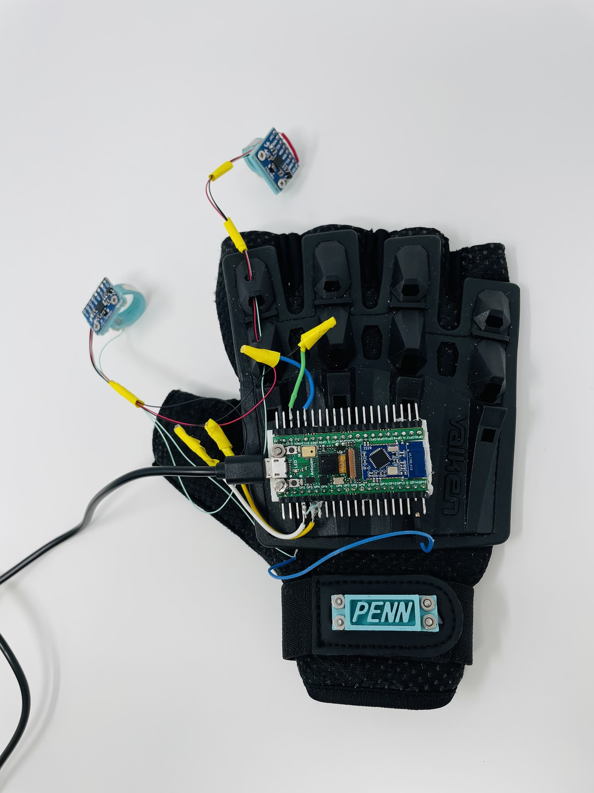
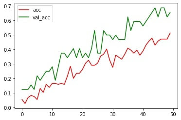
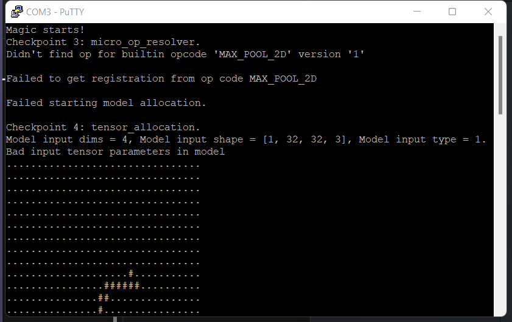
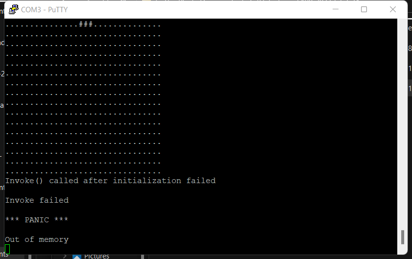

# ESE 5060 Final Project (Team Dark Moon): A Mouse-keyboard System Embedded on A Glove



## Overview
### What is it?
* We designed a mouse-keyboard system which have the curser moving, right clicking, left clicking, and gesture writing functions.
* User can achive the curser function by rotating hand and can achived the clicking function by shaking fingers in the air. The keyboard function is under implementation.

### How to use it?
* **Cursor Movement:** There're two metal panels on these two rings. When you want to move the cursor, just hold these two fingers and let metal contact. The movment direction follows the direction of your palm. Relase fingers can stop moving cursor.
* **Right and Left Clicking:** A click can be done anytime you want. Just act like you are clicking mouse using your thumb(left click) or index finger(right click).

### How did we achieve this?
* We use one IMU to catch orientation change happening on the hand. The accelerometer data is parsed into angles between zx, yx(capture movment inside yz plane). A moving distance corresponds to the angle between z-axis and x-axis and y-axis and x-axis. S.t. a larger angle corresponds to a long movment. We applied sliding window algorithm to smooth data,which average new collected data and previous some data in a time window. This simple and good at reducing noise. 
* We also applied one IMU on thumb and one on index finger to catch an accident and fast movment for clicking use.

### Where did we apply PIO program?
* Unfortunately we didn't applied PIO in our program at last. PIO is a good tool to work as a flexiable commmunication port such as UART, IIC or SPI, but considering we only need one I2C port for our application so we gave up this idea. We also considered using PIO to do simple data processing: addition. PIO can achieve addition in the way `x+y=~(x+~y)`.
* To do so, PIO will invert x and y and then using a loop `(x--==y? y--:x--)`. It did a fair work if it calculates small numbers, while if the number is extremenly large or it is a negative number, it is possible to reach 2^32 iteration for a result, in our experiment, it is very slow to calcute summation between two large positive number or addition including negative number. So we had to gave up this idea as well. But if anyone knows how to optimze this process, feel free to contact us!

### What we haven't done:
* Actually our inital design is a device intergrated mouse and keyboard functions. In our inital plan, keyboard can be achived by adjusting Arducam's magic-wand-ble example and combining tinyusb's HID API.
* We didn't accomplish keyboard function, but we did want to let you know that we also spent lots of time on that function. There're still two issues unresloved in keyboard part:
  * Although we already trained a model that can recognize 26 character and digits, the trained model cannot be deployed on board because some unidentifed errors;
  * We haven't understand the logic to use keyboard API from tinyusb, we didn't find the release keycode method before project deadline. 

## Contribution

|Member|Github Account|Contribution|
|:--|:--|:--|
|Rongqian Chen|@willchan|Implemented curser moving, mouse left clicking, mouse right clicking functions.
|Qi Xue|@suexueqi|Collected data for gesture recognization model, building the model from scartch (including the data processing, model structure tuning, and model training), and implemented model deploying function which connected the gesture recogniztion model with the system.
|Junpeng Zhao|@PZZ97|Investigate tinyusb API, IMU data flitering algorithm, reconstruct code body, mouse and keyboard PIO.

## Mouse Functions

## Keyboard Functions

### Goal
The original magic_wand_ble model can only classify between 0-9. We built our network to classify between both 0-9 and A-Z, which means our model has 36 classes now.

### Result
Colab version of the training part: https://colab.research.google.com/drive/1JqMVoSU88o-7ZZmzwoQUtnsRRwZ0dx7c?usp=sharing

The accuracy of our model after 50 epochs of training:



### Issues
We cannot find how the author, ArduCAM, of the [magic_wand_ble project](https://github.com/ArduCAM/pico-tflmicro/tree/main/examples/magic_wand_ble) train the original model. Thus, we built a classification network from scratch, referencing the network structure of [magic_wand project](https://github.com/tensorflow/tflite-micro/tree/main/tensorflow/lite/micro/examples/magic_wand) of tflit.

#### TFLite Issue
We encountered a warning stating `WARNING:absl:Found untraced functions such as _jit_compiled_convolution_op, _jit_compiled_convolution_op while saving (showing 2 of 2). These functions will not be directly callable after loading.`. We found [this issue](https://github.com/tensorflow/tensorflow/issues/47554) is still opening on the TFLite Github. We were not sure if this warning would affect the loading process of our model.

#### Data Type Issue
In the magic_wand_ble code, it requires the type of the model input to be `kTfLiteInt8 = 9`. We specified the data type of our dataset as `int8` when we converted data to tensor `tf.convert_to_tensor(this_data_batch, dtype=tf.int8)`. However, we load the pre-trained model to the magic_wand_ble system, it shows that the model input data type is still `kTfLiteFloat32 = 1`. We do not know how to solve this yet.



#### Model Size Issue
The new model is about twice as big as the original model (original model: around 20000 parameters; our model: around 50000 parameters). Our system will out of memory after several times of writing.



### Notes
Add this at the beginning of model.cc:

```
/* Copyright 2022 The TensorFlow Authors. All Rights Reserved.

Licensed under the Apache License, Version 2.0 (the "License");
you may not use this file except in compliance with the License.
You may obtain a copy of the License at

    http://www.apache.org/licenses/LICENSE-2.0

Unless required by applicable law or agreed to in writing, software
distributed under the License is distributed on an "AS IS" BASIS,
WITHOUT WARRANTIES OR CONDITIONS OF ANY KIND, either express or implied.
See the License for the specific language governing permissions and
limitations under the License.
==============================================================================*/

// Automatically created from a TensorFlow Lite flatbuffer using the command:
// xxd -i magic_wand_model.tflite > magic_wand_model_data.cc
// See the README for a full description of the creation process.

#include "magic_wand_model_data.h"

const unsigned char g_magic_wand_model_data[]
```
## Mouse and Keyboard PIO

## Others:
### Materials:
|module|quantity|
|:--|:--|
|Pico4ML|1|
|MPU6050|2|
|3D printed rings|2|
|glove|1|
### Reference 
Arducam/pico-tfmicro/magic-wand-ble</br>
Tinyusb 
